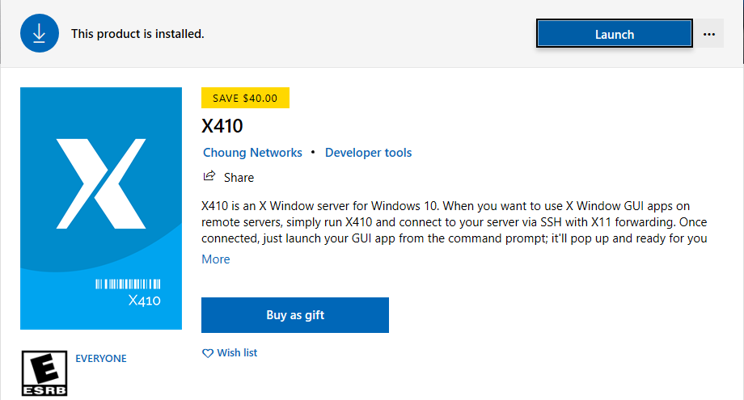
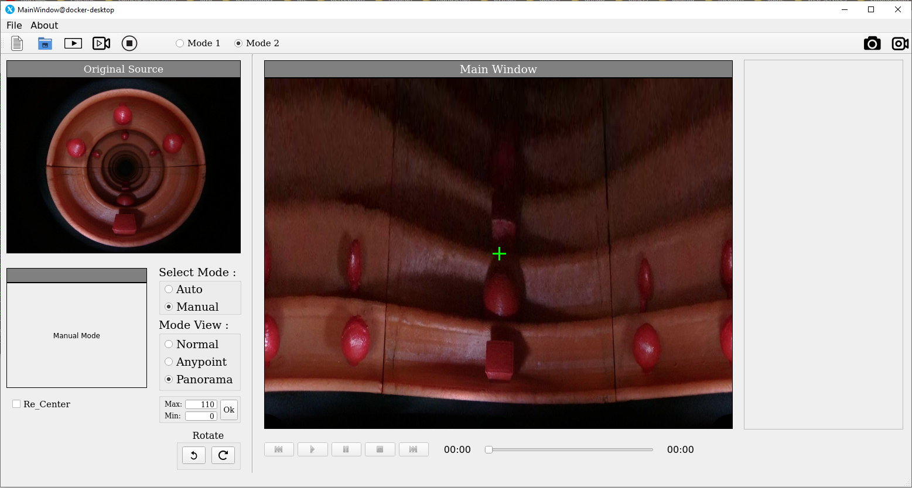

# Running Apps on Docker container

### 1. For windows

​	a. Install docker for windows following [This guideline](https://github.com/anto112/Docker-Instalation) 

​	b. Install x server




c. Open X410 and allow public axis or also can using command line in WSL

```
$ X410.exe /Public
$ export DISPLAY=$(cat /etc/resolv.conf | grep nameserver | awk '{print $2}'):0
$ xhost +
```

d. Clone docker images from docker hub

```
$ docker pull anto112/screening_apps:1.0
```

e. Running container

```
$ docker run --privileged=true -it --net=host -e DISPLAY anto112/screening_apps:1.0
```




### 2. For Linux

For running container in Linux, you just need to following this command line in terminal:

a. Pull docker images

```
$ docker pull anto112/screening_apps:1.0
```

b. Export display and allow access from any host

```
$ echo $DISPLAY
$ xhost +
```

c. Running container

```
$ docker run --privileged=true -it --net=host -e DISPLAY --volume /tmp/.x11-unix anto112/screening_apps:1.0
```

*** Good Luck - Anto112 ***